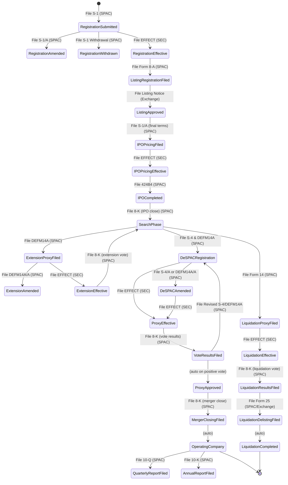

## SPACs

**Special Purpose Acquisition Companies (SPACs)** are formed to raise capital from public investors with the intent to acquire a private company and take it public.

## SPAC State Machine



## SPAC Lifecycle States and Filings

| State                     | Description                          | Required Filing         | Filed By      | Next Possible States                                              |
| ------------------------- | ------------------------------------ | ----------------------- | ------------- | ----------------------------------------------------------------- |
| **Formation Phase**       |
| RegistrationSubmitted     | Initial registration statement filed | S-1                     | SPAC          | RegistrationAmended, RegistrationWithdrawn, RegistrationEffective |
| RegistrationAmended       | Registration statement amended       | S-1/A                   | SPAC          | RegistrationEffective                                             |
| RegistrationWithdrawn     | Registration withdrawn               | S-1 Withdrawal          | SPAC          | _Terminal_                                                        |
| RegistrationEffective     | Registration declared effective      | EFFECT                  | SEC           | ListingRegistrationFiled                                          |
| **Listing Phase**         |
| ListingRegistrationFiled  | Exchange listing registration filed  | Form 8-A                | SPAC          | ListingApproved                                                   |
| ListingApproved           | Exchange approves listing            | Listing Notice          | Exchange      | IPOPricingFiled                                                   |
| **IPO Phase**             |
| IPOPricingFiled           | Final IPO terms filed                | S-1/A (final terms)     | SPAC          | IPOPricingEffective                                               |
| IPOPricingEffective       | IPO pricing declared effective       | EFFECT                  | SEC           | IPOCompleted                                                      |
| IPOCompleted              | IPO prospectus filed                 | 424B4                   | SPAC          | SearchPhase                                                       |
| **Search Phase**          |
| SearchPhase               | SPAC searching for target            | 8-K (IPO close)         | SPAC          | ExtensionProxyFiled, DeSPACRegistration, LiquidationProxyFiled    |
| **Extension Process**     |
| ExtensionProxyFiled       | Extension proxy filed                | DEFM14A                 | SPAC          | ExtensionAmended, ExtensionEffective                              |
| ExtensionAmended          | Extension proxy amended              | DEFM14A/A               | SPAC          | ExtensionEffective                                                |
| ExtensionEffective        | Extension proxy effective            | EFFECT                  | SEC           | SearchPhase                                                       |
| **De-SPAC Process**       |
| DeSPACRegistration        | De-SPAC registration filed           | S-4 & DEFM14A           | SPAC          | DeSPACAmended, ProxyEffective                                     |
| DeSPACAmended             | De-SPAC filings amended              | S-4/A or DEFM14A/A      | SPAC          | ProxyEffective                                                    |
| ProxyEffective            | De-SPAC proxy effective              | EFFECT                  | SEC           | VoteResultsFiled                                                  |
| VoteResultsFiled          | Shareholder vote results filed       | 8-K (vote results)      | SPAC          | ProxyApproved, DeSPACRegistration                                 |
| ProxyApproved             | Shareholders approve merger          | _Auto on positive vote_ | _Auto_        | MergerClosingFiled                                                |
| MergerClosingFiled        | Merger closing filed                 | 8-K (merger close)      | SPAC          | OperatingCompany                                                  |
| **Liquidation Process**   |
| LiquidationProxyFiled     | Liquidation proxy filed              | Form 14                 | SPAC          | LiquidationEffective                                              |
| LiquidationEffective      | Liquidation proxy effective          | EFFECT                  | SEC           | LiquidationResultsFiled                                           |
| LiquidationResultsFiled   | Liquidation vote results filed       | 8-K (liquidation vote)  | SPAC          | LiquidationDelistingFiled                                         |
| LiquidationDelistingFiled | Delisting notice filed               | Form 25                 | SPAC/Exchange | LiquidationCompleted                                              |
| LiquidationCompleted      | SPAC liquidation completed           | _Auto_                  | _Auto_        | _Terminal_                                                        |
| **Operating Company**     |
| OperatingCompany          | Post-merger operating company        | _Auto_                  | _Auto_        | QuarterlyReportFiled, AnnualReportFiled                           |
| QuarterlyReportFiled      | Quarterly report filed               | 10-Q                    | SPAC          | OperatingCompany                                                  |
| AnnualReportFiled         | Annual report filed                  | 10-K                    | SPAC          | OperatingCompany                                                  |

## Implementation Plan

Here is a detailed plan to build and persist the SPAC lifecycle state machine. This plan breaks the project into four main phases:

### Phase 1: Foundation - Form Definitions & Data Extraction

The state machine is driven by SEC filings. The first step is to ensure we can identify and extract the necessary information from each relevant filing.

#### 1.1 Survey and Create Form Classes

Review the "Required Filing" column in the table above. For each form type, ensure a corresponding class exists in `src/sec/forms/`. Key forms include:

- **Registration Forms**: S-1, S-1/A
- **Listing Forms**: 8-A, 424B4
- **Event Reports**: 8-K (multiple event types)
- **Merger Forms**: S-4, S-4/A, DEFM14A, DEFM14A/A
- **Periodic Reports**: 10-Q, 10-K
- **Other Forms**: Form 14 (liquidation), Form 25 (delisting), EFFECT notices

#### 1.2 Detailed Data Extraction Logic

##### **Form S-1 / S-1/A (Registration Statement)**

Extract comprehensive SPAC formation data:

**Company Information:**

- SPAC name, CIK, SIC code
- Business address and contact information
- Formation date and jurisdiction

**Financial Data:**

- Initial trust value/target raise amount
- Unit structure (shares + warrants/rights)
- IPO price per unit
- Underwriter fees and expenses

**Leadership & Management:**

- Officers and directors (names, ages, titles, backgrounds)
- Past business experience and affiliations
- Compensation arrangements
- Stock ownership percentages

**Sponsor Information:**

- Sponsor entity name and structure
- Sponsor principals and their backgrounds
- Initial capital contribution
- Founder shares and private placement details
- Lock-up provisions

**Investment Strategy:**

- Target industry sectors or geographic focus
- Acquisition criteria (size, valuation, etc.)
- Management's relevant industry experience

**Key Dates:**

- Filing date
- Expected closing date
- Liquidation deadline (typically 18-24 months)

##### **Form 8-K (Current Report)**

8-K forms report various material events. For SPACs, key items include:

**Item 1.01 - Entry into Material Agreement**

- Letter of Intent (LOI) details
- Non-binding indication of interest
- Exclusivity agreements

**Item 2.01 - Completion of Acquisition**

- Target company name and description
- Transaction valuation and structure
- Sources and uses of funds
- Pro forma ownership percentages

**Item 2.03 - Creation of Direct Financial Obligation**

- PIPE financing details (amount, investors, terms)
- Bridge loans or other financing

**Item 3.02 - Unregistered Sales of Securities**

- Private placement details
- Forward purchase agreements

**Item 5.01 - Changes in Control**

- New ownership structure post-merger

**Item 5.02 - Departure/Appointment of Officers**

- Management changes
- Board composition changes

**Item 5.03 - Amendments to Articles/Bylaws**

- Extension amendments
- Changes to share structure

**Item 5.07 - Submission of Matters to Vote**

- Vote results (for/against/abstain)
- Redemption statistics (shares redeemed, % of float)
- Meeting date and quorum

**Item 8.01 - Other Events**

- Definitive Agreement (DA) announcement
- Unit split details (date, ratios)
- Trust account updates
- Liquidation notices

##### **Form S-4 / DEFM14A (Merger Registration/Proxy)**

**Target Company Information:**

- Name, industry, description
- Historical financials (3-5 years)
- Management team and board
- Major shareholders

**Transaction Details:**

- Enterprise value and equity value
- Exchange ratio and consideration
- Earnout provisions
- Lock-up agreements

**Financial Projections:**

- Revenue and EBITDA projections
- Key assumptions and growth drivers

**PIPE Investment:**

- Total PIPE size
- Lead investors and allocations
- PIPE pricing and terms

**Pro Forma Information:**

- Combined company ownership
- Board composition
- Management structure

**Redemption Provisions:**

- Redemption price per share
- Redemption deadline
- Trust value per share

##### **Form 424B4 (Final Prospectus)**

**IPO Completion Data:**

- Final offering size
- Final unit price
- Underwriter allocations
- Closing date
- Trading symbols (units, common, warrants)

##### **Form 10-Q / 10-K (Periodic Reports)**

**Trust Account Status:**

- Current trust value
- Investment income earned
- Per share trust value

**Operating Metrics:**

- Cash outside trust
- Operating expenses
- Management fees paid

**Search Updates:**

- Target evaluation progress
- Letters of intent signed
- Due diligence activities

**Extension Information:**

- Extension payments made
- Remaining time to complete business combination

#### 1.3 Unit Testing Strategy

For each form type:

- Create test files following the pattern: `Form_[TYPE].test.ts`
- Add representative mock data to `src/sec/forms/spac/mock_data/`
- Test extraction of all key fields
- Validate edge cases (missing data, format variations)

### Phase 2: Persistence - Database Schema & Repositories

#### 2.1 Core SPAC Schema (`SpacSchema.ts`)

#### 2.2 Related Schemas

**SpacPersonSchema.ts** - Leadership and key individuals

**SpacSponsorSchema.ts** - Sponsor entities

**SpacTransactionSchema.ts** - Financial events

#### 2.3 Repository Implementation

**SpacRepo.ts**:

#### 2.4 Testing Pattern

**SpacRepo.test.ts**:

### Phase 2.5: UI-Oriented Data Modeling

To support comprehensive UI requirements, all data models must maintain full historical context with proper versioning and timeline support.

#### 2.5.1 Event Timeline Schema (`SpacEventSchema.ts`)

#### 2.5.2 Versioned Person Schema (`SpacPersonHistorySchema.ts`)

#### 2.5.3 Versioned Relationship Schema (`SpacRelationshipSchema.ts`)

#### 2.5.4 Target Company History Schema (`SpacTargetHistorySchema.ts`)

#### 2.5.5 UI Query Patterns

To support efficient UI queries, create specialized views and methods:

```typescript
// Timeline query
interface TimelineQuery {
  getFullTimeline(spacId: string): SpacEvent[];
  getFilteredTimeline(
    spacId: string,
    filters: {
      includeFailedEvents?: boolean;
      eventTypes?: SpacEventType[];
      dateRange?: { start: Date; end: Date };
    }
  ): SpacEvent[];
}

// People query
interface PeopleQuery {
  getCurrentPeople(spacId: string): SpacCurrentPeople;
  getPersonHistory(spacId: string, personId: string): SpacPersonHistory[];
  getAllPeopleEver(spacId: string): SpacPersonHistory[];
}

// Relationship query
interface RelationshipQuery {
  getActiveRelationships(spacId: string): SpacRelationship[];
  getAllRelationships(spacId: string): SpacRelationship[];
  getRelationshipHistory(spacId: string, entityName: string): SpacRelationship[];
}

// Target company query
interface TargetQuery {
  getCurrentTarget(spacId: string): SpacTargetHistory | null;
  getAllTargetAttempts(spacId: string): SpacTargetHistory[];
  getFailedTargets(spacId: string): SpacTargetHistory[];
}
```

#### 2.5.6 UI Data Aggregation

Create pre-computed views for common UI needs:

```typescript
interface SpacDashboardData {
  spac_id: string;

  // Current snapshot
  current_state: SpacState;
  days_until_deadline: number;
  trust_value_per_share: number;

  // People summary
  active_management_count: number;
  total_people_involved: number;
  recent_departures: SpacPersonHistory[];

  // Timeline summary
  total_events: number;
  last_material_event: SpacEvent;
  upcoming_deadlines: Date[];

  // Target summary
  current_target?: SpacTargetHistory;
  failed_target_count: number;

  // Financial summary
  current_trust_value: number;
  total_redemptions?: number;
  pipe_committed?: number;
}
```

This enhanced data model ensures the UI has complete flexibility to:

- Show full historical timelines or filter to only successful events
- Display all people ever involved or just current team
- Track relationship changes over time
- Show failed acquisition attempts alongside successful ones
- Present data in various formats (timeline, dashboard, detailed views)

### Phase 3: Business Logic - State Machine & Tasks

#### 3.1 State Machine Implementation (`SpacStateMachine.ts`)

#### 3.2 Task Implementation

**IdentifyNewSpacsTask.ts**

- Scan S-1 filings for SPAC indicators
- Keywords: "blank check company", "special purpose acquisition"
- Create initial SPAC records

**ProcessSpacFilingTask.ts**

- Route filings to appropriate extractors
- Update state machine
- Record transactions and events
- Update related entities (people, sponsors)

**MonitorSpacDeadlinesTask.ts**

- Track approaching liquidation deadlines
- Alert on expiring extensions
- Monitor trust account thresholds

**UpdateSpacMetricsTask.ts**

- Calculate current trust value per share
- Track redemption trends
- Update performance metrics

### Phase 4: Integration & Analytics

#### 4.1 Command-Line Interface

Add commands in `src/commands/`:

- `UpdateAllSpacs.ts` - Main orchestration
- `SpacReport.ts` - Generate SPAC status reports
- `SpacAnalytics.ts` - Calculate success rates, redemption trends

#### 4.2 Analytics & Reporting

Track key metrics:

- SPAC formation trends by sponsor type
- Average time to DA announcement
- Redemption rates by sector
- Successful vs. liquidated SPACs
- Sponsor track records

#### 4.3 Alert System

Monitor for:

- New SPAC IPOs
- DA announcements
- High redemption rates
- Approaching deadlines
- Management changes

This comprehensive approach ensures we capture all relevant SPAC lifecycle data for analysis and tracking.
